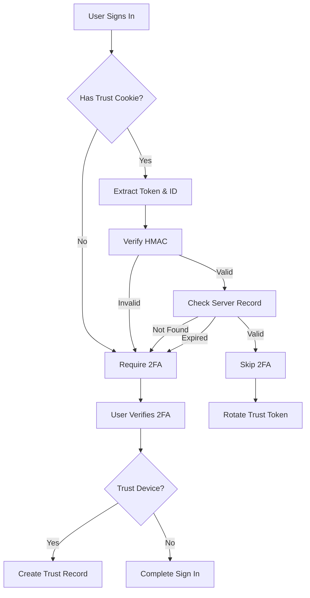

Trusted Devices is a feature built into the [Two-Factor Authentication](/security/two-factor) plugin that allows users to mark their devices as trusted. Once trusted, users can skip 2FA verification on that device for a configurable period (default: 30 days).

## How It Works

1. **User enables 2FA** and verifies with TOTP, OTP, or backup code
2. **User opts to trust the device** during verification
3. **Secure cookie is set** with an HMAC-signed token
4. **Server-side record created** in the verification table
5. **On subsequent sign-ins**, the cookie is verified against the server record
6. **If valid**, 2FA verification is skipped
7. **Cookie is rotated** on each successful sign-in for security

<Note>
Trusted devices use both a client-side cookie and server-side record for security. The cookie alone is not sufficient; it must match the server-side record.
</Note>

## Usage

### Trust a Device During 2FA Verification

When verifying a TOTP code:

```ts
import { authClient } from "@/lib/auth-client"

const { data, error } = await authClient.twoFactor.verifyTotp({
  code: "123456",
  trustDevice: true // Trust this device
})
```

When verifying an OTP:

```ts
import { authClient } from "@/lib/auth-client"

const { data, error } = await authClient.twoFactor.verifyOtp({
  code: "123456",
  trustDevice: true
})
```

When verifying a backup code:

```ts
import { authClient } from "@/lib/auth-client"

const { data, error } = await authClient.twoFactor.verifyBackupCode({
  code: "ABCDE-12345",
  trustDevice: true
})
```

### UI Implementation

Provide a checkbox for users to opt into trusting the device:

```tsx
import { authClient } from "@/lib/auth-client"
import { useState } from "react"

export default function Verify2FA() {
  const [code, setCode] = useState("")
  const [trustDevice, setTrustDevice] = useState(false)
  const [error, setError] = useState("")
  
  const handleVerify = async (e: React.FormEvent) => {
    e.preventDefault()
    setError("")
    
    const { data, error: verifyError } = await authClient.twoFactor.verifyTotp({
      code,
      trustDevice
    })
    
    if (verifyError) {
      setError(verifyError.message)
      return
    }
    
    // Redirect to dashboard
    window.location.href = "/dashboard"
  }
  
  return (
    <form onSubmit={handleVerify}>
      <h2>Two-Factor Authentication</h2>
      
      <div>
        <label>Verification Code</label>
        <input
          type="text"
          value={code}
          onChange={(e) => setCode(e.target.value)}
          placeholder="Enter 6-digit code"
          maxLength={6}
          required
        />
      </div>
      
      <div>
        <label>
          <input
            type="checkbox"
            checked={trustDevice}
            onChange={(e) => setTrustDevice(e.target.checked)}
          />
          Trust this device for 30 days
        </label>
        <p className="help-text">
          You won't be asked for a code on this device for 30 days
        </p>
      </div>
      
      {error && <div className="error">{error}</div>}
      
      <button type="submit">Verify</button>
    </form>
  )
}
```

## Configuration

### Trust Duration

Configure how long devices remain trusted (in seconds):

```ts title="auth.ts"
import { betterAuth } from "better-auth"
import { twoFactor } from "better-auth/plugins"

export const auth = betterAuth({
  plugins: [
    twoFactor({
      trustDeviceMaxAge: 60 * 60 * 24 * 30 // 30 days (default)
    })
  ]
})
```

Common durations:

```ts
// 7 days
trustDeviceMaxAge: 60 * 60 * 24 * 7

// 30 days (default)
trustDeviceMaxAge: 60 * 60 * 24 * 30

// 90 days
trustDeviceMaxAge: 60 * 60 * 24 * 90

// 1 year
trustDeviceMaxAge: 60 * 60 * 24 * 365
```

## Security Features

### HMAC Signing

The trust device cookie contains an HMAC-signed token:

```
{token}!{trustIdentifier}
```

Where:
- `token`: HMAC signature using your app's secret
- `trustIdentifier`: Unique identifier for this trust record

The HMAC prevents cookie tampering:

```ts
// Server-side verification (automatic)
const [token, trustIdentifier] = cookieValue.split('!')
const expectedToken = await createHMAC('SHA-256', 'base64urlnopad')
  .sign(secret, `${userId}!${trustIdentifier}`)

if (token !== expectedToken) {
  // Cookie has been tampered with
  expireCookie()
}
```

### Server-Side Verification

Trust records are stored server-side in the `verification` table:

```ts
{
  identifier: "trust-device-{randomString}",
  value: userId,
  expiresAt: Date // When trust expires
}
```

Both the cookie **and** server record must match for trust to be valid.

### Automatic Rotation

On each successful sign-in with a trusted device:

1. Old trust record is deleted
2. New trust identifier is generated
3. New HMAC token is created
4. New cookie is set
5. New server record is created

This rotation prevents long-lived tokens from being stolen and reused.

### Expiration

Trust expires when:
- The configured `trustDeviceMaxAge` is reached
- The user disables 2FA (trust records are deleted)
- The user explicitly revokes trust (if you implement this)
- The server-side record is deleted

## Implementation Details

### Cookie Attributes

```ts
{
  name: "better_auth.trust_device",
  httpOnly: true,
  secure: true, // HTTPS only
  sameSite: "lax",
  maxAge: trustDeviceMaxAge
}
```

### Verification Flow

When a user with 2FA enabled signs in:



## Managing Trusted Devices

### View Trusted Devices (Optional Implementation)

You can implement a UI to show users their trusted devices:

```ts title="app/api/trusted-devices/route.ts"
import { auth } from "@/lib/auth"
import { headers } from "next/headers"

export async function GET() {
  const session = await auth.api.getSession({ headers: headers() })
  
  if (!session) {
    return Response.json({ error: "Unauthorized" }, { status: 401 })
  }
  
  // Query verification records for this user
  const devices = await db.verification.findMany({
    where: {
      identifier: { startsWith: "trust-device-" },
      value: session.user.id,
      expiresAt: { gt: new Date() }
    }
  })
  
  return Response.json({ devices })
}
```

### Revoke Trust (Optional Implementation)

Allow users to revoke trust from specific devices:

```ts title="app/api/trusted-devices/revoke/route.ts"
import { auth } from "@/lib/auth"
import { headers } from "next/headers"

export async function POST(request: Request) {
  const session = await auth.api.getSession({ headers: headers() })
  const { trustId } = await request.json()
  
  if (!session) {
    return Response.json({ error: "Unauthorized" }, { status: 401 })
  }
  
  // Delete the trust record
  await db.verification.delete({
    where: {
      identifier: trustId,
      value: session.user.id // Ensure user owns this record
    }
  })
  
  return Response.json({ success: true })
}
```

### Revoke All Devices

When a user disables 2FA, all trust records are automatically deleted:

```ts
import { authClient } from "@/lib/auth-client"

const { data } = await authClient.twoFactor.disable({
  password: "user-password"
})

// All trusted devices are now revoked
```

## Best Practices

<Steps>
  <Step>
    ### Use appropriate trust durations
    
    Balance security and convenience:
    - **High security**: 7 days
    - **Balanced**: 30 days (default)
    - **Convenient**: 90 days
    
    Never exceed 1 year.
  </Step>
  
  <Step>
    ### Provide clear UI
    
    Explain what trusting a device means:
    
    ```tsx
    <label>
      <input type="checkbox" checked={trustDevice} />
      Trust this device for 30 days
    </label>
    <p className="help-text">
      You won't need to enter a code on this device for 30 days.
      Don't check this on shared or public computers.
    </p>
    ```
  </Step>
  
  <Step>
    ### Warn about public devices
    
    ```tsx
    {isPublicNetwork && (
      <Warning>
        This appears to be a public network. We recommend not trusting
        this device for your security.
      </Warning>
    )}
    ```
  </Step>
  
  <Step>
    ### Implement device management
    
    Allow users to:
    - View all trusted devices
    - See when each device was last used
    - Revoke trust from specific devices
    - Revoke trust from all devices
  </Step>
  
  <Step>
    ### Log trust events
    
    Track when devices are trusted or revoked:
    
    ```ts
    await logSecurityEvent({
      userId: session.user.id,
      event: "device_trusted",
      metadata: {
        userAgent: request.headers.get("user-agent"),
        ip: getIp(request)
      }
    })
    ```
  </Step>
</Steps>

## Security Considerations

### When to Use

Trusted devices are appropriate when:
- Users frequently sign in from the same devices
- Users control their devices (personal computers, phones)
- The added convenience outweighs slightly reduced security

### When Not to Use

Avoid trusted devices when:
- Users access your app from shared computers
- You have strict compliance requirements
- You handle highly sensitive data
- Your threat model requires 2FA on every sign-in

### Limitations

<Warning>
Trusted devices reduce security by allowing sign-in without 2FA. Consider:

- A stolen device can be used to access the account
- Cookies can potentially be stolen via XSS (though mitigated by httpOnly)
- Trust should never be permanent
</Warning>

## Comparison with Other Methods

| Method | Security | Convenience | Use Case |
|--------|----------|-------------|----------|
| **Always Require 2FA** | Highest | Lowest | High-security applications |
| **Trusted Devices** | High | Medium | Most applications |
| **Remember for Session** | Medium | High | Low-risk applications |
| **No 2FA** | Low | Highest | Public, non-sensitive apps |

## Example: Complete Implementation

```tsx title="app/settings/security/page.tsx"
import { authClient } from "@/lib/auth-client"
import { useState, useEffect } from "react"

export default function SecuritySettings() {
  const [trustedDevices, setTrustedDevices] = useState([])
  
  useEffect(() => {
    loadTrustedDevices()
  }, [])
  
  const loadTrustedDevices = async () => {
    const res = await fetch("/api/trusted-devices")
    const data = await res.json()
    setTrustedDevices(data.devices)
  }
  
  const revokeDevice = async (trustId: string) => {
    await fetch("/api/trusted-devices/revoke", {
      method: "POST",
      headers: { "Content-Type": "application/json" },
      body: JSON.stringify({ trustId })
    })
    loadTrustedDevices()
  }
  
  const revokeAll = async () => {
    // Disable and re-enable 2FA to clear all trust
    const { data } = await authClient.twoFactor.disable({
      password: prompt("Enter your password")
    })
    
    if (data) {
      await authClient.twoFactor.enable({
        password: prompt("Enter your password again")
      })
    }
    
    loadTrustedDevices()
  }
  
  return (
    <div>
      <h2>Trusted Devices</h2>
      
      {trustedDevices.length === 0 ? (
        <p>No trusted devices</p>
      ) : (
        <div>
          <p>These devices can sign in without 2FA:</p>
          
          {trustedDevices.map((device) => (
            <div key={device.identifier}>
              <span>Device trusted on {device.createdAt}</span>
              <span>Expires {device.expiresAt}</span>
              <button onClick={() => revokeDevice(device.identifier)}>
                Revoke
              </button>
            </div>
          ))}
          
          <button onClick={revokeAll}>
            Revoke All Devices
          </button>
        </div>
      )}
    </div>
  )
}
```

## Related

- [Two-Factor Authentication](/security/two-factor) - Main 2FA documentation
- [Rate Limiting](/security/rate-limiting) - Protect against brute force
- [CAPTCHA](/security/captcha) - Additional bot protection